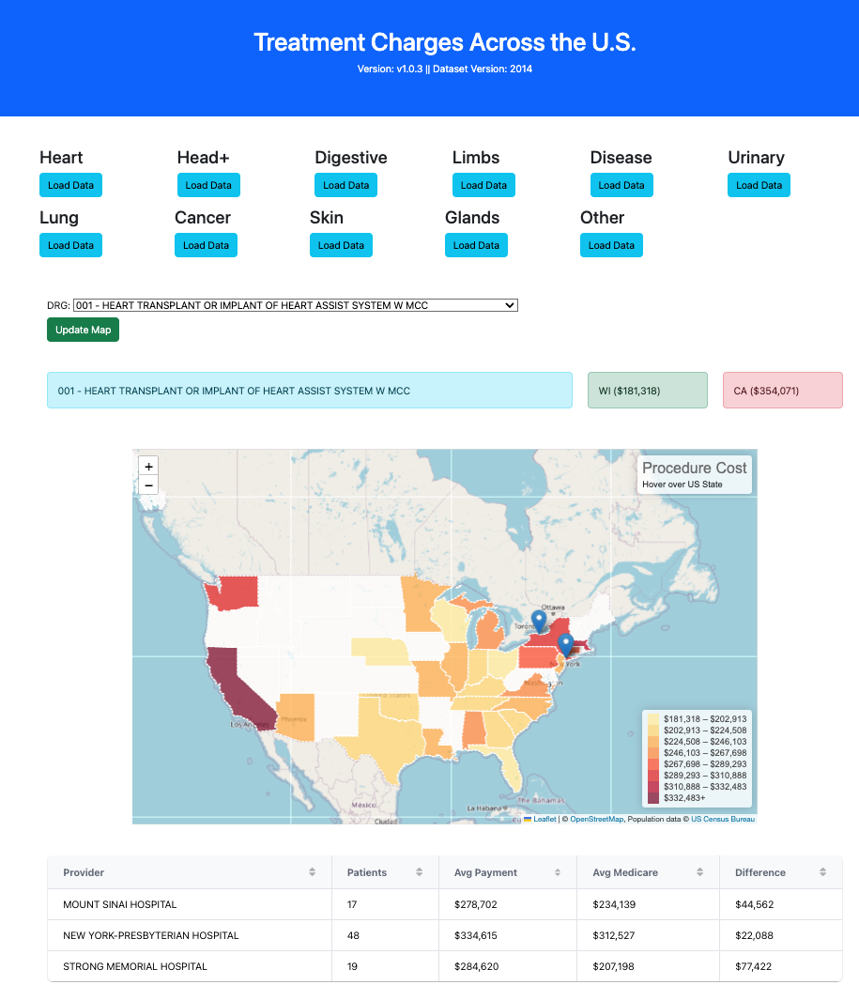

# Surgery/Treatment Cost Across US States

A simple web-app to visualize surgery/treatment cost across US states

## Description

The cost of surgery/medical treament can vary significantly across the United States, with a range of several thousand dollars for common procedures. This variation is due to a number of factors, including the type of surgery, the surgeon's experience, the geographic location, and the type of insurance plan.

For example, according to a study by the FAIR Health Care organization, the average cost of a hip replacement in the United States is $30,000. However, the cost can range from $15,000 to $55,000, depending on the state. For example, the average cost of a hip replacement in New York is $45,000, while the average cost in Mississippi is $20,000.

The variation in surgery/treatment costs across the United States can be a significant burden for patients. As such, it is important for patients to shop around for the best price on surgery and to understand their insurance coverage before undergoing surgery. This web-app aims to provide users with a simple tool to making finding the most cost effective health care facility to under a particular surgery. [Bard helped with this](https://g.co/bard/share/7991c25ec23c)

## Getting Started

### Dependencies
1. Flask
2. Flask-CORS
3. SQLAlchemy
4. PostgreSQL
5. Sqlite3

### Installing

Database Files Importing. All files found in the "Data" directory.
* PostgresSQL (recommended): 
	1. Using pgAdmin create a database called "SugeryCharges"
	2. Run the QuickDBD-SQL.sql
	3. Import the "drg.csv", "providers.csv", and "drg_records.csv" in that order
	4. update the Flask/app.py with the proper credentials for the PostgreSQL database. Make sure to uncomment this line, and comment the Sqlite line.
* SQlite:
	1. By default the Flask app is setup to use the SurgeryCharges.sqlite3 file in the Data directory. Depending on if you are on Windows or MacOS please edit the app.py file to point to the correct location of this file.

### Executing Flask backend

1. Download source code from GitHub
2. Change to "installation location"/Flask directory
3. Execute "python app.py"
4. Open http://localhost:5015/view in Browser 

## Authors

Contributors names and contact info

* Cameron Cullen
* Eric Llorente
* Matt Lantin
* Nathan Stevens 

## Version History
* 1.0.6
	* Checks database connection before starting Flask application
* 1.0.5
    * Bug fix for running on Windows
* 1.0.3
    * Initial Release

## License

This project is licensed under the GPL License

## Acknowledgments
Various frameworks, libraries, and database tools/engines used:

* [Flask Micro Framework](https://flask.palletsprojects.com/en/3.0.x/)
* [Flask-CORS](https://flask-cors.readthedocs.io/en/latest/) 
* [Leaflet](https://leafletjs.com/)
* [Plotly](https://plotly.com/javascript/)
* [Grid.js](https://gridjs.io/)
* [SQLAlchemy](https://www.sqlalchemy.org/)
* [SQlite3](https://www.sqlite.org/index.html)
* [SQLiteStudio](https://sqlitestudio.pl/)
* [PostgresSQL](https://www.postgresql.org/)